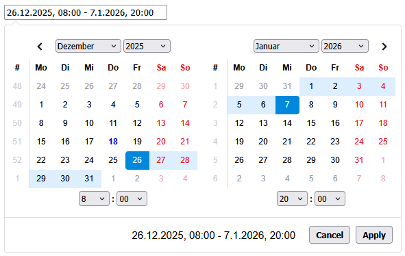
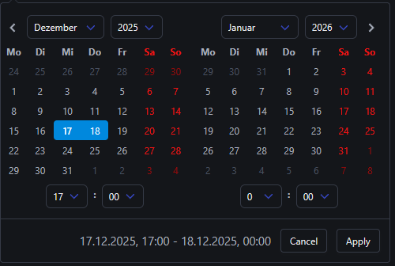
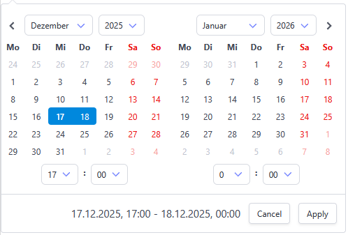

# Date Range Picker



This date range picker component creates a dropdown menu from which a user can
select a range of dates.

Features include limiting the selectable date range, localizable strings and date formats,
a single date picker mode, a time picker, and predefined date ranges.

### [Documentation and Live Usage Examples](http://www.daterangepicker.com)

### [See It In a Live Application](https://awio.iljmp.com/5/drpdemogh)

Above samples are based on the [original repository](https://github.com/dangrossman/daterangepicker) from Dan Grossman. [New features](#Features) from this fork are not available in these samples.

## Basic usage

#### Global import with `<script>` tags
```html
<script type="text/javascript" src="https://cdn.jsdelivr.net/npm/luxon@3.5.0/build/global/luxon.min.js"></script>
<script type="text/javascript" src="https://cdn.jsdelivr.net/npm/@wernfried/daterangepicker@5.1.1-beta/dist/global/daterangepicker.min.js"></script>
<link type="text/css" href="https://cdn.jsdelivr.net/npm/@wernfried/daterangepicker@{{process.env.version}}/css/daterangepicker.min.css" rel="stylesheet" />

<input type="text" id="picker" />

<script type="text/javascript">
   const DateTime = luxon.DateTime;
   DateRangePicker.daterangepicker('#picker', {
      startDate: DateTime.now().plus({day: 1})
   }, (start, end) => {
      console.log(`Selected range: ${start.toString()} to ${end.toString()}`)
   });
</script>
```

#### ESM Imports
```html
<script type="importmap">
{
   "imports": {
      "luxon": "https://cdn.jsdelivr.net/npm/luxon@3.7.2/+esm",
      "daterangepicker": "https://cdn.jsdelivr.net/npm/@wernfried/daterangepicker@5.1.1-beta/+esm"
   }
}
</script>
<link type="text/css" href="https://cdn.jsdelivr.net/npm/@wernfried/daterangepicker@5.1.1-beta/css/daterangepicker.min.css" rel="stylesheet" />

<input type="text" id="picker" />

<script type="module">
   import { DateTime } from 'luxon';
   import { daterangepicker } from 'daterangepicker';

   daterangepicker('#picker', {
      startDate: DateTime.now().plus({day: 1})
   }, (start, end) => {
      console.log(`Selected range: ${start.toString()} to ${end.toString()}`)
   });
</script>
```

#### Style with Bulma
```html
<script type="text/javascript" src="https://cdn.jsdelivr.net/npm/luxon@3.5.0/build/global/luxon.min.js"></script>
<script type="text/javascript" src="https://cdn.jsdelivr.net/npm/@wernfried/daterangepicker@5.1.1-beta/dist/global/daterangepicker.min.js"></script>
<link type="text/css" href="https://cdn.jsdelivr.net/npm/bulma@1.0.4/css/bulma.min.css" rel="stylesheet" />
<link type="text/css" href="https://cdn.jsdelivr.net/npm/@wernfried/daterangepicker@5.1.1-beta/css/daterangepicker.bulma.min.css" rel="stylesheet" />

<input type="text" id="picker" />

<script type="text/javascript">
   const DateTime = luxon.DateTime;
   DateRangePicker.daterangepicker('#picker', {
      startDate: DateTime.now().plus({day: 1})
   });
</script>
```

#### Use of `data-*` attributes
```html
<input type="text" id="picker" 
   data-start-date="2026-02-01" 
   data-end-date="2026-02-20" 
   data-show-week-numbers="true" />

<script>
   const options = {timePicker: true};
   DateRangePicker.daterangepicker('#picker', options);
</script>
```
See [HTML5 data-* Attributes](https://api.jquery.com/data/#data-html5)<br/>
Values in `options` of `daterangepicker(el, options)` take precedence over `data-*` attributes.

#### Access the DateRangePicker Instance
```html
<input type="text" id="picker" />

<script type="module">
   import {daterangepicker, getDateRangePicker} from 'daterangepicker'; // or global import with <script> tag
   
   const input = daterangepicker('#picker', {}); // returns the mutated <input> HTMLElement
   // or daterangepicker(document.querySelector('#picker'), {})

   const drp = getDateRangePicker('#picker');
   // or DateRangePicker.getDateRangePicker('#picker'); if imported globally with <script> tag

   console.log( drp.startDate.toString()) // prints the selected startDate
   console.log( drp === input._daterangepicker) // prints 'true'
   console.log( drp.element === input) // prints 'true'
   console.log( document.querySelector('#picker') === input) // prints 'true'
</script>
```

#### Upgrade from daterangepicker version 4.x -> 5.x

In version 5.x jQuery dependency has been removed. Version 4.x is available at branch [4.x-jQuery](tree/4.x-jQuery) but new features will not added anymore to this branch.<br> 
Unlesss you work with Events, you should not face any difference between version 4.x and 5.x.
Initialisation with jQuery is supported in version 5.x

```html
<script type="text/javascript" src="https://cdn.jsdelivr.net/jquery/latest/jquery.min.js"></script>
<script type="text/javascript" src="https://cdn.jsdelivr.net/npm/luxon@3.5.0/build/global/luxon.min.js"></script>
<script type="text/javascript" src="https://cdn.jsdelivr.net/npm/@wernfried/daterangepicker@5.1.1-beta/dist/global/daterangepicker.min.js"></script>
<link type="text/css" href="https://cdn.jsdelivr.net/npm/@wernfried/daterangepicker@5.1.1-beta/css/daterangepicker.min.css" rel="stylesheet" />

<input type="text" id="picker" />

<script type="text/javascript">
   const DateTime = luxon.DateTime;
   
   // if you like to work with jQuery in version 5.x
   $(function() {
      $('#picker').daterangepicker({
         startDate: DateTime.now().plus({day: 1})
      });
   }).on('beforeHide', (ev) => {
      console.log(ev.originalEvent.picker.startDate.toString());
      ev.preventDefault(); // -> do not hide the picker
   });
</script>
```

In case you work with Events there are a few minor changes:
```js
// version 4.x - with jQuery
$('#picker').daterangepicker({
   startDate: DateTime.now(),
   // allow only dates from current year
   minDate: DateTime.now().startOf('year'),
   manDate: DateTime.now().endOf('year'),
   singleDatePicker: true
}).on('violate.daterangepicker', (ev, picker, result, newDate) => {
   newDate.startDate = DateTime.now().minus({ days: 3 }).startOf('day');
   return true;
}).on('show.daterangepicker', (ev, picker) => {
   console.log('Show the picker')
}).on('beforeHide.daterangepicker', (ev, picker) => {
   console.log(picker.startDate.toString());
   return true; // -> do not hide the picker
});

// version 5.x - without jQuery
const input = daterangepicker('#picker', { // or DateRangePicker.daterangepicker('#picker', ...
   startDate: DateTime.now(),
   // allow only dates from current year
   minDate: DateTime.now().startOf('year'),
   manDate: DateTime.now().endOf('year'),
   singleDatePicker: true
});

input.addEventListener('violate', (ev) => {
   ev.newDate.startDate = DateTime.now().minus({ days: 3 }).startOf('day');
   ev.preventDefault();
});
input.addEventListener('show', (ev) => {
   console.log('Show the picker')
});
input.addEventListener('beforeHide', (ev) => {
   console.log(ev.picker.startDate.toString());
   ev.preventDefault(); // -> do not hide the picker
});
```


## Examples
### Option `ranges`
<a name="options-ranges"></a>
```js
range: {
   'Today': [DateTime.now().startOf('day'), DateTime.now().endOf('day')],
   'Yesterday': [DateTime.now().startOf('day').minus({day: 1}), DateTime.now().endOf('day').minus({day: 1})],
   'Last 7 Days': ['2025-03-01', '2025-03-07'],
   'Last 30 Days': [new Date(new Date - 1000*60*60*24*30), new Date()],
   'This Month': [DateTime.now().startOf('month'), DateTime.now().endOf('month')],
   'Last Month': [DateTime.now().minus({month: 1}).startOf('month'), DateTime.now().minus({month: 1}).endOf('month')]
},
alwaysShowCalendars: true
```

### Option `isInvalidDate`
```js
isInvalidDate: function(date) {
   return date.isWeekend; // see https://moment.github.io/luxon/api-docs/index.html#datetimeisweekend
}
```

### Option `isInvalidTime`
```js
isInvalidTime: (time, side, unit) => {   
   if (unit == 'hour') {
      return time.hour >= 10 && time.hour <= 14; // Works also with 12-hour clock      
   } else {
      return false;
   }
}
```

### Option `isCustomDate`
```js
.daterangepicker-bank-day {
  color: red;
}
.daterangepicker-weekend-day {
  color: blue;
}

isCustomDate: function(date) {
   if (date.isWeekend)
      return 'daterangepicker-weekend-day';

   const yyyy = date.year;
   let bankDays = [
      DateTime.fromObject({ year: yyyy, month: 1, day: 1 }), // New year
      DateTime.fromObject({ year: yyyy, month: 7, day: 4 }), // Independence Day
      DateTime.fromObject({ year: yyyy, month: 12, day: 25 }) // Christmas Day
   ];
   return bankDays.some(x => x.hasSame(date, 'day')) ? 'daterangepicker-bank-day' : '';
}
```
### Features
Compared to [inital repository](https://github.com/dangrossman/daterangepicker), this fork added following features and changes:

- Replaced [moment](https://momentjs.com/) by [luxon](https://moment.github.io/luxon/index.html) (see differences below)
- Added option `weekendClasses`, `weekendDayClasses`, `todayClasses` to highlight weekend days or today, respectively 
- Added option `timePickerStepSize` to succeed options `timePickerIncrement` and `timePickerSeconds`
- Added events `dateChange.daterangepicker` and `timeChange.daterangepicker` emitted when user clicks on a date/time
- Added event `beforeHide.daterangepicker` enables you to keep the picker visible after click on `Apply` or `Cancel` button.
- Added event `beforeRenderTimePicker.daterangepicker` and `beforeRenderCalendar.daterangepicker` emitted before elements are rendered
- Added event `violated.daterangepicker` emitted when user input is not valid
- Added method `setRange(startDate, endDate)` to combine `setStartDate(startDate)` and `setEndDate(endDate)`
- Added option `minSpan` similar to `maxSpan`
- Added option `isInvalidTime` similar to `isInvalidDate`
- Added option `altInput` and `altFormat` to provide an alternative output element for selected date value
- Added option `onOutsideClick` where you can define whether picker shall apply or revert selected value
- Added option `initalMonth` to show datepicker without an initial date
- Added option `singleMonthView` to show single month calendar, useful for shorter ranges
- Better validation of input parameters, errors are logged to console
- Highlight range in calendar when hovering over pre-defined ranges
- Option `autoUpdateInput` defines whether the attached `<input>` element is updated when the user clicks on a date value.<br>
In original daterangepicker this parameter defines whether the `<input>` is updated when the user clicks on `Apply` button.
- Added option `locale.durationFormat` to show customized label for selected duration, e.g. `'4 Days, 6 Hours, 30 Minutes'`
- Support styling with 3rd party CSS Frameworks. Currently only [Bulma](https://bulma.io/) is supported<br>
but other frameworks may be added in future releases
- [ESM](https://developer.mozilla.org/en-US/docs/Web/JavaScript/Guide/Modules) Module Import
- [Jest](https://jestjs.io/) unit testing
- Removed dependency from [jQuery](https://jquery.com/)
- ... and maybe some new bugs 😉 

### Localization
All date values are based on [luxon](https://moment.github.io/luxon/index.html#/intl) which provides great support for localization. Instead of providing date format, weekday and month names manually as strings, it is usually easier to set the default locale like this:
```js
const Settings = luxon.Settings;
Settings.defaultLocale = 'fr-CA'

daterangepicker('#picker', {
   timePicker: true,
   singleDatePicker: false
};
```
instead of 
```js
daterangepicker('#picker', {
   timePicker: true,
   singleDatePicker: false,
   locale: {
      format: 'yyyyy-M-d H h m',
      daysOfWeek: [ 'lun.', 'mar.', 'mer.', 'jeu.', 'ven.', 'sam.', 'dim.' ],
      monthNames: [ "janvier', 'février', 'mars', 'avril', 'mai', 'juin', 'juillet', 'août', 'septembre', 'octobre', 'novembre', 'décembre" ],
      firstDay: 7
   }
};
```

### Style and themes

You can style this daterangepicker with [Bulma CSS Framework](https://bulma.io/). Light and dark theme is supported:






## Methods

Available methods are listed in detail at [API Documentation](API_Doc.md). You will mainly use 
## Options
Options for DateRangePicker

**Kind**: global typedef  
**Properties**

| Name | Type | Default | Description |
| --- | --- | --- | --- |
| parentEl | <code>string</code> \| [<code>HTMLElement</code>](https://developer.mozilla.org/de/docs/Web/API/HTMLElement) | <code>&quot;body&quot;</code> | [Document querySelector](https://developer.mozilla.org/en-US/docs/Web/API/Document/querySelector#selectors)  or `HTMLElement` of the parent element that the date range picker will be added to |
| startDate | [<code>DateTime</code>](https://moment.github.io/luxon/api-docs/index.html#datetime) \| [<code>Date</code>](https://developer.mozilla.org/en-US/docs/Web/JavaScript/Reference/Global_Objects/Date) \| <code>string</code> \| <code>null</code> |  | Default: `DateTime.now().startOf('day')`<br>The beginning date of the initially selected date range.<br> Must be a `luxon.DateTime` or `Date` or `string` according to [ISO-8601](https://en.wikipedia.org/wiki/ISO_8601) or a string matching `locale.format`.<br> Date value is rounded to match option `timePickerStepSize`<br> Option `isInvalidDate` and `isInvalidTime` are not evaluated, you may set date/time which is not selectable in calendar.<br> If the date does not fall into `minDate` and `maxDate` then date is shifted and a warning is written to console.<br> Use `startDate: null` to show calendar without an inital selected date. |
| endDate | [<code>DateTime</code>](https://moment.github.io/luxon/api-docs/index.html#datetime) \| [<code>Date</code>](https://developer.mozilla.org/en-US/docs/Web/JavaScript/Reference/Global_Objects/Date) \| <code>string</code> |  | Defautl: `DateTime.now().endOf('day')`<br>The end date of the initially selected date range.<br> Must be a `luxon.DateTime` or `Date` or `string` according to [ISO-8601](https://en.wikipedia.org/wiki/ISO_8601) or a string matching `locale.format`.<br> Date value is rounded to match option `timePickerStepSize`<br> Option `isInvalidDate`, `isInvalidTime` and `minSpan`, `maxSpan` are not evaluated, you may set date/time which is not selectable in calendar.<br> If the date does not fall into `minDate` and `maxDate` then date is shifted and a warning is written to console.<br> |
| minDate | [<code>DateTime</code>](https://moment.github.io/luxon/api-docs/index.html#datetime) \| [<code>Date</code>](https://developer.mozilla.org/en-US/docs/Web/JavaScript/Reference/Global_Objects/Date) \| <code>string</code> \| <code>null</code> |  | The earliest date a user may select or `null` for no limit.<br> Must be a `luxon.DateTime` or `Date` or `string` according to [ISO-8601](https://en.wikipedia.org/wiki/ISO_8601) or a string matching `locale.format`. |
| maxDate | [<code>DateTime</code>](https://moment.github.io/luxon/api-docs/index.html#datetime) \| [<code>Date</code>](https://developer.mozilla.org/en-US/docs/Web/JavaScript/Reference/Global_Objects/Date) \| <code>string</code> \| <code>null</code> |  | The latest date a user may select or `null` for no limit.<br> Must be a `luxon.DateTime` or `Date` or `string` according to [ISO-8601](https://en.wikipedia.org/wiki/ISO_8601) or a string matching `locale.format`. |
| minSpan | [<code>Duration</code>](https://moment.github.io/luxon/api-docs/index.html#duration) \| <code>string</code> \| <code>number</code> \| <code>null</code> |  | The minimum span between the selected start and end dates.<br> Must be a `luxon.Duration` or number of seconds or a string according to [ISO-8601](https://en.wikipedia.org/wiki/ISO_8601) duration.<br> Ignored when `singleDatePicker: true` |
| maxSpan | [<code>Duration</code>](https://moment.github.io/luxon/api-docs/index.html#duration) \| <code>string</code> \| <code>number</code> \| <code>null</code> |  | The maximum  span between the selected start and end dates.<br> Must be a `luxon.Duration` or number of seconds or a string according to [ISO-8601](https://en.wikipedia.org/wiki/ISO_8601) duration.<br> Ignored when `singleDatePicker: true` |
| defaultSpan | [<code>Duration</code>](https://moment.github.io/luxon/api-docs/index.html#duration) \| <code>string</code> \| <code>number</code> \| <code>null</code> |  | The span which is used when endDate is automatically updated due to wrong user input<br> Must be a `luxon.Duration` or number of seconds or a string according to [ISO-8601](https://en.wikipedia.org/wiki/ISO_8601) duration.<br> Ignored when `singleDatePicker: true`. Not relevant if `minSpan: null` |
| initalMonth | [<code>DateTime</code>](https://moment.github.io/luxon/api-docs/index.html#datetime) \| [<code>Date</code>](https://developer.mozilla.org/en-US/docs/Web/JavaScript/Reference/Global_Objects/Date) \| <code>string</code> \| <code>null</code> |  | Default: `DateTime.now().startOf('month')`<br> The inital month shown when `startDate: null`. Be aware, the attached `<input>` element must be also empty.<br> Must be a `luxon.DateTime` or `Date` or `string` according to [ISO-8601](https://en.wikipedia.org/wiki/ISO_8601) or a string matching `locale.format`.<br> When `initalMonth` is used, then `endDate` is ignored and it works only with `timePicker: false` |
| autoApply | <code>boolean</code> | <code>false</code> | Hide the `Apply` and `Cancel` buttons, and automatically apply a new date range as soon as two dates are clicked.<br> Only useful when `timePicker: false` |
| singleDatePicker | <code>boolean</code> | <code>false</code> | Show only a single calendar to choose one date, instead of a range picker with two calendars.<br> If `true`, then `endDate` is always `null`. |
| singleMonthView | <code>boolean</code> | <code>false</code> | Show only a single month calendar, useful when selected ranges are usually short<br> or for smaller viewports like mobile devices.<br> Ignored for `singleDatePicker: true`. |
| showDropdowns | <code>boolean</code> | <code>false</code> | Show year and month select boxes above calendars to jump to a specific month and year |
| minYear | <code>number</code> |  | Default: `DateTime.now().minus({year:100}).year`<br>The minimum year shown in the dropdowns when `showDropdowns: true` |
| maxYear | <code>number</code> |  | Default: `DateTime.now().plus({year:100}).year`<br>The maximum  year shown in the dropdowns when `showDropdowns: true` |
| showWeekNumbers | <code>boolean</code> | <code>false</code> | Show **localized** week numbers at the start of each week on the calendars |
| showISOWeekNumbers | <code>boolean</code> | <code>false</code> | Show **ISO** week numbers at the start of each week on the calendars.<br> Takes precedence over localized `showWeekNumbers` |
| timePicker | <code>boolean</code> | <code>false</code> | Adds select boxes to choose times in addition to dates |
| timePicker24Hour | <code>boolean</code> | <code>true|false</code> | Use 24-hour instead of 12-hour times, removing the AM/PM selection.<br> Default is derived from current locale [Intl.DateTimeFormat.resolvedOptions.hour12](https://developer.mozilla.org/en-US/docs/Web/JavaScript/Reference/Global_Objects/Intl/DateTimeFormat/resolvedOptions#hour12). |
| timePickerStepSize | [<code>Duration</code>](https://moment.github.io/luxon/api-docs/index.html#duration) \| <code>string</code> \| <code>number</code> |  | Default: `Duration.fromObject({minutes:1})`<br>Set the time picker step size.<br> Must be a `luxon.Duration` or the number of seconds or a string according to [ISO-8601](https://en.wikipedia.org/wiki/ISO_8601) duration.<br> Valid values are 1,2,3,4,5,6,10,12,15,20,30 for `Duration.fromObject({seconds: ...})` and `Duration.fromObject({minutes: ...})`  and 1,2,3,4,6,(8,12) for `Duration.fromObject({hours: ...})`.<br> Duration must be greater than `minSpan` and smaller than `maxSpan`.<br> For example `timePickerStepSize: 600` will disable time picker seconds and time picker minutes are set to step size of 10 Minutes. |
| autoUpdateInput | <code>boolean</code> | <code>true</code> | Indicates whether the date range picker should instantly update the value of the attached `<input>`  element when the selected dates change.<br>The `<input>` element will be always updated on `Apply` and reverted when user clicks on `Cancel`. |
| onOutsideClick | <code>string</code> | <code>&quot;apply&quot;</code> | Defines what picker shall do when user clicks outside the calendar.  `'apply'` or `'cancel'`. Event [onOutsideClick](#event_outsideClick) is always emitted. |
| linkedCalendars | <code>boolean</code> | <code>true</code> | When enabled, the two calendars displayed will always be for two sequential months (i.e. January and February),  and both will be advanced when clicking the left or right arrows above the calendars.<br> When disabled, the two calendars can be individually advanced and display any month/year |
| isInvalidDate | <code>function</code> | <code>false</code> | A function that is passed each date in the two calendars before they are displayed,<br>  and may return `true` or `false` to indicate whether that date should be available for selection or not.<br> Signature: `isInvalidDate(date)`<br> |
| isInvalidTime | <code>function</code> | <code>false</code> | A function that is passed each hour/minute/second/am-pm in the two calendars before they are displayed,<br>  and may return `true` or `false` to indicate whether that date should be available for selection or not.<br> Signature: `isInvalidTime(time, side, unit)`<br> `side` is `'start'` or `'end'` or `null` for `singleDatePicker: true`<br> `unit` is `'hour'`, `'minute'`, `'second'` or `'ampm'`<br> Hours are always given as 24-hour clock<br> Ensure that your function returns `false` for at least one item. Otherwise the calender is not rendered.<br> |
| isCustomDate | <code>function</code> | <code>false</code> | A function that is passed each date in the two calendars before they are displayed,  and may return a string or array of CSS class names to apply to that date's calendar cell.<br> Signature: `isCustomDate(date)` |
| altInput | <code>string</code> \| <code>Array</code> \| [<code>HTMLInputElement</code>](https://developer.mozilla.org/de/docs/Web/API/HTMLInputElement) | <code>null</code> | A [Document querySelector](https://developer.mozilla.org/en-US/docs/Web/API/Document/querySelector#selectors)<br> string or `HTMLElement`  for an alternative output (typically hidden) `<input>` element. Uses `altFormat` to format the value.<br> Must be a single string/HTMLElement for `singleDatePicker: true` or an array of two strings or HTMLElement for `singleDatePicker: false`<br> Example: `['#start', '#end']` |
| altFormat | <code>function</code> \| <code>string</code> |  | The output format used for `altInput`.<br> Default: ISO-8601 basic format without time zone, precisison is derived from `timePicker` and `timePickerStepSize`<br> Example `yyyyMMdd'T'HHmm` for `timePicker=true` and display of Minutes<br>  If defined, either a string used with [Format tokens](https://moment.github.io/luxon/#/formatting?id=table-of-tokens) or a function.<br> Examples: `"yyyy:MM:dd'T'HH:mm"`,<br>`(date) => date.toUnixInteger()` |
| applyButtonClasses | <code>string</code> | <code>&quot;btn-primary&quot;</code> | CSS class names that will be added only to the apply button |
| cancelButtonClasses | <code>string</code> | <code>&quot;btn-default&quot;</code> | CSS class names that will be added only to the cancel button |
| buttonClasses | <code>string</code> |  | Default: `'btn btn-sm'`<br>CSS class names that will be added to both the apply and cancel buttons. |
| weekendClasses | <code>string</code> | <code>&quot;weekend&quot;</code> | CSS class names that will be used to highlight weekend days.<br> Use `null` or empty string if you don't like to highlight weekend days. |
| weekendDayClasses | <code>string</code> | <code>&quot;weekend-day&quot;</code> | CSS class names that will be used to highlight weekend day names.<br> Weekend days are evaluated by [Info.getWeekendWeekdays](https://moment.github.io/luxon/api-docs/index.html#infogetweekendweekdays) and depend on current  locale settings. Use `null` or empty string if you don't like to highlight weekend day names. |
| todayClasses | <code>string</code> | <code>&quot;today&quot;</code> | CSS class names that will be used to highlight the current day.<br> Use `null` or empty string if you don't like to highlight the current day. |
| opens | <code>string</code> | <code>&quot;right&quot;</code> | Whether the picker appears aligned to the left, to the right, or centered under the HTML element it's attached to.<br> `'left' \| 'right' \| 'center'` |
| drops | <code>string</code> | <code>&quot;down&quot;</code> | Whether the picker appears below or above the HTML element it's attached to.<br> `'down' \| 'up' \| 'auto'` |
| ranges | <code>object</code> | <code>{}</code> | Set predefined date [Ranges](#Ranges) the user can select from. Each key is the label for the range,  and its value an array with two dates representing the bounds of the range. |
| showCustomRangeLabel | <code>boolean</code> | <code>true</code> | Displays "Custom Range" at the end of the list of predefined [Ranges](#Ranges),  when the ranges option is used.<br> This option will be highlighted whenever the current date range selection does not match one of the predefined ranges.<br> Clicking it will display the calendars to select a new range. |
| alwaysShowCalendars | <code>boolean</code> | <code>false</code> | Normally, if you use the ranges option to specify pre-defined date ranges,  calendars for choosing a custom date range are not shown until the user clicks "Custom Range".<br> When this option is set to true, the calendars for choosing a custom date range are always shown instead. |
| showLabel= | <code>boolean</code> |  | Shows selected range next to Apply buttons.<br> Defaults to `false` if anchor element is `<input type="text">`, otherwise `true` |
| locale | <code>object</code> | <code>{}</code> | Allows you to provide localized strings for buttons and labels, customize the date format,  and change the first day of week for the calendars. |
| locale.direction | <code>string</code> | <code>&quot;ltr&quot;</code> | Direction of reading, `'ltr'` or `'rtl'` |
| locale.format | <code>object</code> \| <code>string</code> |  | Default: `DateTime.DATE_SHORT` or `DateTime.DATETIME_SHORT` when `timePicker: true`<br>Date formats.  Either given as string, see [Format Tokens](https://moment.github.io/luxon/#/formatting?id=table-of-tokens) or an object according  to [Intl.DateTimeFormat](https://developer.mozilla.org/en-US/docs/Web/JavaScript/Reference/Global_Objects/Intl/DateTimeFormat)<br> I recommend to use the luxon [Presets](https://moment.github.io/luxon/#/formatting?id=presets). |
| locale.separator | <code>string</code> |  | Defaut: `' - '`<br>Separator for start and end time |
| locale.weekLabel | <code>string</code> | <code>&quot;W&quot;</code> | Label for week numbers |
| locale.daysOfWeek | <code>Array</code> |  | Default: `luxon.Info.weekdays('short')`<br>Array with weekday names, from Monday to Sunday |
| locale.monthNames | <code>Array</code> |  | Default: `luxon.Info.months('long')`<br>Array with month names |
| locale.firstDay | <code>number</code> |  | Default: `luxon.Info.getStartOfWeek()`<br>First day of the week, 1 for Monday through 7 for Sunday |
| locale.applyLabel | <code>string</code> | <code>&quot;Apply&quot;</code> | Label of `Apply` Button |
| locale.cancelLabel | <code>string</code> | <code>&quot;Cancel&quot;</code> | Label of `Cancel` Button |
| locale.customRangeLabel | <code>string</code> | <code>&quot;Custom&quot;</code> | Range - Title for custom ranges |
| locale.durationFormat | <code>object</code> \| <code>string</code> \| <code>function</code> | <code>{}</code> | Format a custom label for selected duration, for example `'5 Days, 12 Hours'`.<br> Define the format either as string, see [Duration.toFormat - Format Tokens](https://moment.github.io/luxon/api-docs/index.html#durationtoformat) or  an object according to [Intl.NumberFormat](https://developer.mozilla.org/en-US/docs/Web/JavaScript/Reference/Global_Objects/Intl/NumberFormat/NumberFormat#options),  see [Duration.toHuamn](https://moment.github.io/luxon/api-docs/index.html#durationtohuman).<br> Or custom function as `(startDate, endDate) => {}` |

